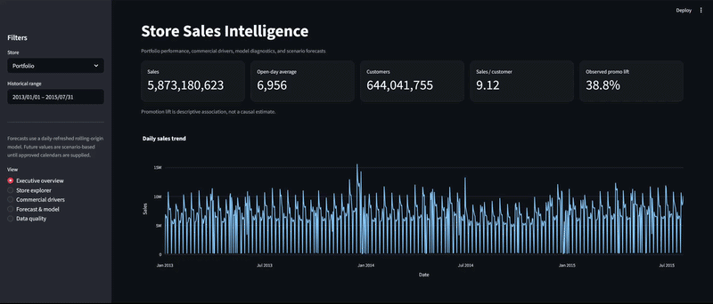
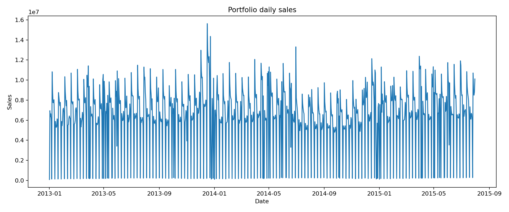
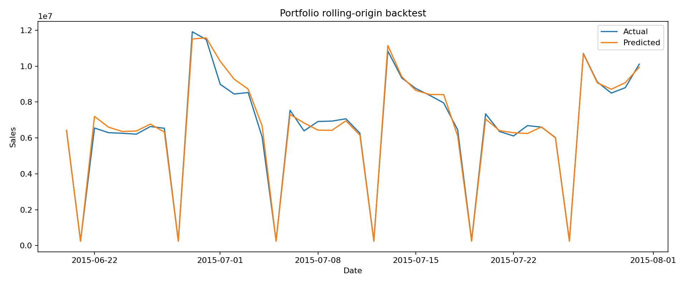
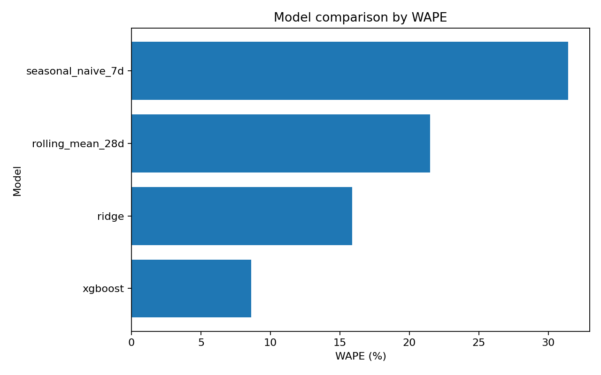
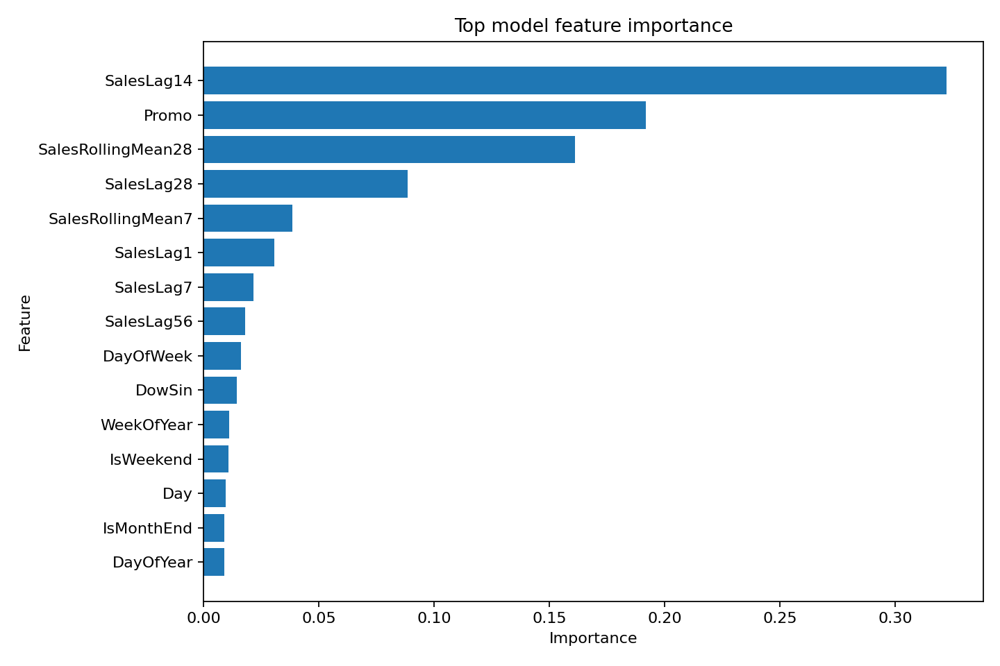

# Store Sales Forecasting & Analytics



A production-style analytics project for **daily retail sales forecasting, business analysis, and decision support**.  
This repository combines time-series forecasting, feature engineering, model comparison, and an interactive **Streamlit dashboard** to demonstrate the workflow of a senior data analyst: validating data, building leakage-aware forecasting models, interpreting commercial drivers, and translating results into business recommendations.

---

## 1. Project Overview

This project builds an end-to-end **store sales forecasting and analytics workflow** from daily transactional sales history and store metadata.

### Project objective

Given historical daily store sales and store attributes, forecast future sales and provide business-facing insight into:

- promotion effects,
- store performance,
- forecast accuracy,
- operating patterns,
- and commercial decision support.

The workflow includes raw data ingestion, data validation, feature engineering, rolling-origin forecasting evaluation, model comparison, error diagnostics, business analysis, and dashboard delivery.

Unlike many simple forecasting demos, this project is designed to reflect a more realistic analytics workflow:

- data quality checks before modeling,
- leakage prevention in time-series features,
- baseline comparisons,
- interpretable metrics,
- store-level monitoring,
- and clear limitations around what the model can and cannot claim.

---

## 2. Dataset

This project uses a daily **store-level retail sales dataset** with store metadata.

The modeling scope includes:

- **1,017,209 store-day observations**
- **1,115 stores**
- data spanning **2013-01-01 through 2015-07-31**

The data includes daily sales and operational variables such as:

- store ID
- date
- sales
- customer counts
- whether the store was open
- promotion status
- holiday indicators
- store type
- assortment
- competition information

Because this is a forecasting problem, the dataset requires time-aware preprocessing and feature engineering rather than simple random train/test splitting.

> **Important note:** Customer counts are useful for descriptive analytics, but they are intentionally excluded from forecasting features because they are not known at prediction time.

---

## 3. Business Question



The project addresses two related business questions:

1. **How accurately can future daily store sales be forecasted using historical sales, calendar effects, and store metadata?**
2. **What commercial patterns and operational insights can be extracted from the data to support sales, staffing, and promotion planning?**

This makes the repository both:

- a **forecasting project**, focused on predictive performance, and
- a **business analytics project**, focused on interpretable commercial insight.

---

## 4. Technologies and Methods Used

The workflow is implemented in **Python** and uses:

- **pandas** and **NumPy** for data wrangling
- **scikit-learn** for modeling pipelines, preprocessing, and metrics
- **XGBoost** for gradient-boosted forecasting
- **matplotlib** and **plotly / Streamlit visualizations** for reporting
- **Streamlit** for the interactive dashboard
- **pytest** for testing

### Forecasting and analytics methods include

- chronological train/validation splitting
- rolling-origin backtesting
- leakage-aware lag and rolling features
- seasonal and moving-average baselines
- Ridge regression
- Random Forest support
- HistGradientBoosting support
- XGBoost forecasting
- business-oriented forecasting metrics
- residual analysis
- feature importance analysis
- store-level error monitoring

### Metrics used

The project compares models using:

- **WAPE**
- **RMSPE**
- **MAE**
- **RMSE**
- **Bias**
- **R²**

WAPE is treated as the primary operational metric because it is interpretable at the portfolio level.

---

## 5. Preprocessing and Feature Engineering

### Raw data ingestion

The project reads:

- daily store-level sales history
- store metadata

These are joined into a modeling table for downstream analysis.

### Data validation

The workflow includes integrity checks such as:

- duplicate detection
- validation of store-date uniqueness
- missing-value handling
- checks on closed-store observations
- review of competition and promotion metadata completeness

### Feature engineering

The forecasting table includes time-aware features such as:

- calendar features:
  - day of week
  - month
  - year
  - holiday indicators
- store features:
  - store ID
  - store type
  - assortment
  - competition distance
- operational drivers:
  - promo
  - open / closed status
- lag features:
  - prior-day and prior-period sales
- rolling features:
  - rolling averages
  - rolling trends
  - recent sales dynamics

### Leakage prevention

Time leakage is explicitly controlled:

- lag features are created using only **prior dates**
- future information is excluded from training features
- random train/test splitting is **not used**
- customer counts are excluded from forecasting because they are unavailable for future predictions

This is important because many retail forecasting examples overstate performance by accidentally including information that would not be available at prediction time.

---

## 6. Modeling Approach

The project compares several baseline and machine-learning approaches.

### Seasonal naive baseline

A simple weekly seasonal baseline is included to represent a practical benchmark.

### Moving-average baseline

A rolling average baseline is used to test whether the ML models outperform a simple short-memory heuristic.

### Ridge regression

Ridge provides an interpretable linear benchmark for time-series features.

### Tree-based models

The project includes support for:

- Random Forest
- HistGradientBoosting
- XGBoost

These models can capture nonlinear relationships and interactions between:

- promotions,
- seasonality,
- store identity,
- holidays,
- and recent sales behavior.

### Selected model

The bundled selected model is **XGBoost**, chosen because it provided the strongest validation performance in the included backtest.

---

## 7. Results

### Forecasting performance



The selected XGBoost model was evaluated on the **final 42 days** using a **daily refreshed rolling-origin validation design**.

This means that when predicting a given day, the model is allowed to use sales observed **before that day** for lag-based features. This reflects an operational forecasting workflow that is refreshed each morning.

### Validation results



| Model | WAPE | RMSPE | MAE |
|------|------:|------:|------:|
| XGBoost | **8.6%** | **12.4%** | **601** |
| Ridge | 15.9% | 24.6% | 1,108 |
| 28-day Rolling Mean | 21.5% | 27.9% | 1,500 |
| Weekly Seasonal Naive | 31.4% | 41.0% | 2,192 |

Additional selected-model notes:

- Bias is approximately **+1.0%**
- The best 10% of stores by validation WAPE are below **6.4%**
- The worst 10% exceed **11.1%**

### Interpretation

These are strong forecasting results for daily store-level sales, especially relative to the baselines.

However, the results should be interpreted honestly:

- this is a **rolling operational forecast**,
- store-level performance varies, so monitoring is still important,
- and future scenario forecasts are illustrative until replaced with approved operating calendars.

> **Key finding:** The gradient-boosted forecasting approach materially outperforms statistical baselines and produces business-useful accuracy at the portfolio level, while still requiring store-level monitoring and careful calendar assumptions.

---

## 8. Commercial Findings

In addition to forecasting, the project produces descriptive business insight from the historical data.

### Selected findings

- Historical sales total approximately **5.87B**
- Average sales on an open, positive-sales day are approximately **6,956**
- Sales per recorded customer average approximately **9.12**
- Promotion days show approximately **38.8% higher average sales** than non-promotion days
- After comparing within the same store and weekday, the median observed promotion difference remains approximately **36.5%**
- Store type **b** has the highest average open-day sales
- Assortment **b** has the highest average open-day sales
- Day-of-week **7** has the highest average sales
- Month **12** has the highest average open-day sales
- Sales and customer counts have a **0.824 correlation**
- January–July 2015 sales were approximately **5.8% higher** than the same period in 2014

### Important caution

Promotion findings in this project are **associational**, not causal.  
They should not be interpreted as direct estimates of campaign lift without controlled or quasi-experimental analysis.

---

## 9. Dashboard

The repository includes an interactive **Streamlit dashboard** for business users and analysts.

### Dashboard pages

1. **Executive Overview**
   - KPIs
   - portfolio sales trend
   - promotion associations
   - forecast accuracy
   - generated business insights

2. **Store Explorer**
   - store-level history
   - weekday patterns
   - customer productivity
   - store-specific backtest performance

3. **Commercial Drivers**
   - promotion analysis
   - store type
   - assortment
   - competition distance
   - calendar effects

4. **Forecast & Model**
   - actual vs predicted
   - residual diagnostics
   - model comparison
   - feature importance
   - future scenario forecast outputs

5. **Data Quality**
   - missingness
   - integrity checks
   - assumptions
   - forecasting limitations

---

## 10. Plots and Tables

### Forecasting plots

- Model comparison by WAPE
- Actual vs predicted backtest plot
- Residual diagnostics
- Forecast trend visualizations
- Feature importance charts

### Commercial and diagnostic plots

- Portfolio sales trend
- Store-level performance views
- Promotion vs non-promotion sales
- Day-of-week and month seasonality
- Store-type and assortment comparisons
- Data quality summaries

### Tables



- Model metrics
- Store-level forecast performance
- Forecast outputs
- Data quality checks
- Executive insight summaries
- Feature importance tables

---

## 11. Scenario Forecasting

The project also includes a **future scenario forecasting** workflow.

The model expects future values for variables such as:

- `Open`
- `Promo`
- `StateHoliday`
- `SchoolHoliday`

A future calendar template can be used to generate a 42-day scenario forecast.

### Important limitation

This scenario forecast is **illustrative**, not a committed production forecast, until the future calendar assumptions are replaced with the approved operating and promotion schedule.

That means the forecast should not be used directly for staffing, inventory, or sales targets until business-approved assumptions are provided.

---

## 12. Statistical Assumptions and Limitations

### Rolling forecast interpretation

The validation design is a **daily refreshed rolling-origin** evaluation.  
It should not be confused with a fixed-horizon forecast made entirely in advance.

### Store heterogeneity

Forecast quality varies across stores. Strong portfolio-level performance does not guarantee equally strong performance for every individual location.

### Promotion interpretation

Observed promotion uplift is descriptive and should not be treated as causal evidence.

### Future assumptions

Future forecasts depend on assumptions about:

- store openings and closures
- promotion schedules
- holiday schedules

If these assumptions are inaccurate, the forecast will also be inaccurate.

### Data availability

Customer counts are strongly correlated with sales historically, but they are not available in advance and are therefore excluded from forecasting features.

---

## 13. Business Recommendations

Based on the analysis, the project recommends:

1. Use the dashboard to identify high-volume stores with unusually large residuals
2. Review promotion performance by **store type and weekday**, not only at the portfolio level
3. Replace generated future calendar assumptions with approved operating calendars before using forecasts operationally
4. Track **WAPE and bias weekly** at both portfolio and store levels
5. Treat feature importance as predictive attribution, not as proof of commercial causality

---

## 14. Repository Structure

```text
app/                         Streamlit dashboard
configs/                     Modeling configuration
src/sales_forecasting/       Reusable source code
scripts/                     Training and reporting entry points
data/raw/                    Raw input files
data/processed/              Dashboard-ready processed outputs
models/                      Serialized model artifacts
reports/                     Metrics, figures, predictions, and summaries
notebooks/                   Analytical workflows
tests/                       Unit tests
